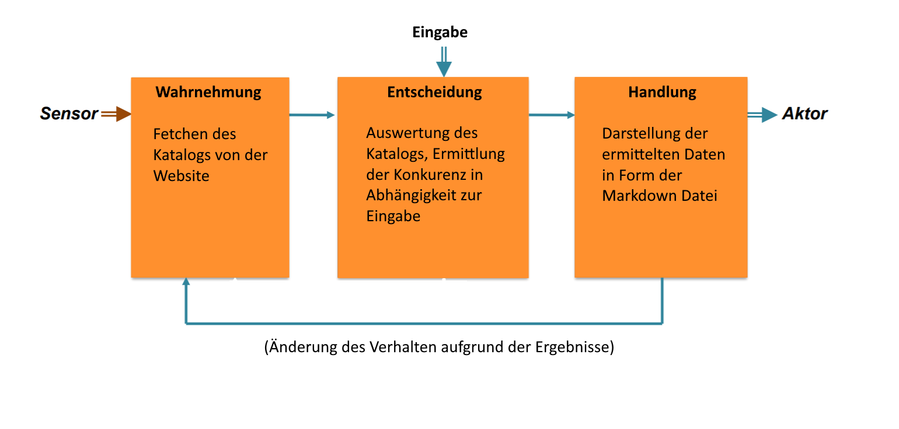

# Uatu

Uatu is an analytics tool for the Minecraft marketplace in the prototype stage (it uses nodejs modules and the typescript programming language)

```
npm: 6.14.14
nodejs: 14.17.5
typescript: 4.4.4
```

Command für die Instalation: `npm install -i`

Command zum starten des Programms: `npm start`

# **Dokumentation**

## **Beschreibung**

Der Focus dieser Software ist es Produkte aus dem [Minecraft Marketplace](https://www.minecraft.net/en-us/catalog) zusammeln und ausgehend von einem Produkt oder Team ähnliche Produkte bzw Team zu ermitteln welche in direkter Konkurenz zum jeweiligen Produkt oder Team stehen. Die Ermitlung zu ähnlichen Pordukten finden über deren Produkttypen,gengre,subgenre und tags statt. Bei Produkttypen unterscheidet man zwischen worldtemplates,mashups,skinpacks,resourcepacks und bundles. Dabei stellt bundles die kleinste Kategorie mit drei Produkten und skinpacks die größte Kategorie mit über 10000 Produkten dar. Ich habe mich während dem testen auf die Kategorie worldtemplates fokussiert und nur diese getestet, da sie mit 4763 Produkten (Stand 03.01.22) und 5065 Produkten (Stand 18.02.22)eine gute Basis zum testen dargestellt hat.

### **Pervasive Computing**

Hier möchte ich mich nocheinmal an einer groben Einordnung meiner Software in das Themengebiet des pervasive Computing versuchen.<br>



Im Kontext des Reiz-Reaktions-Modells erfolgt eine Aufnahme des Katalogs, welches Daten aus dem Physical Environment (die Produkte innerhalb des Katalogs) aufnimmt. Basierend darauf und dem dazukommenten User-Input ermittelt der Algorihtmus die entsprechenden Konkurenten.Am Enden werden die Daten in Form von einer menschenlesbaren Markdown Datei ausgegeben. Sollte ein Team basierend auf den Ergebnissen eine Änderung in Publishing Verhalten entwickeln kann dieses als Rückreaktion von Entscheidung zu Wahrnehmung dargestellt werden. Auch wenn diese Reaktion nicht vom System durchgeführt wird wird deren Ergebniss beim erneuten fetchen im Katalog einsehbar sein. Im Laufe Schritte werden die Katalog Daten (roher Kontext) in Daten, die für das System relevant sind, umgewandelt (normalisierter Kontext). Und die Ausgabe erfolgt in einem Rahmen, der die Konkurenten für Menschen (einigermaßen) übersichtlich darstellt (komplexer Kontext).

### **Algorithmus**

Wenn zu einem Produkt die Konkurenz gesucht wird als Start der Produkttyp,das Genre, das Subgenre und die Tags genutzt. Infrage kommende Produkte müssen einerseits erstmal von anderen Teams stammen, da man nicht mit sich selbst in Konkurenz stehen kann. Andererseits müssen die Produkte vom gleichen Produkttyp stammen und das gleiche Genre bedienen. Das Produkt wird zur Menge, der konkurierenden Produkte, hinzugefügt, wenn nun auch mindestens ein Tag **oder** das Subgenre übereinstimmt. Da Subgengre bereits einen genauen filter darstellen ist hierbei sichergestellt das die Inhalte zumindest zu einem gewissen Punkt übereinstimmen. Allerdings besitzt nicht jedes Produkt ein Subgenre weshalb die Tag-Abfrage notwendig ist. Wenn alle konkurierenden Produkte gefunden wurden werden diese nach Teams sortiert. Das Team mit den meisten Produkten wird hierbei als der größte Konkurent angesehen. Innerhalb des Teams werden die Produkte nach Aufrufen sortiert, da nicht Bekannte/Beliebte Produkte keine Konkurenz darstellen.

### **Benutzung**

In der [startup.ts](https://github.com/akokay/Uatu/blob/main/src/startup.ts) Datei passiert der initiale Zugriff auf den [MarketplacetHandler](https://github.com/akokay/Uatu/blob/main/src/backend/MarketplacetHandler.ts) welcher alle wichtigen Funktionen enthält. Als erstes wird von der startup.ts ein Aufruf zum fetchen des Marketplace Katalogs gemacht. Wenn der Boolean newFetch auf true gesetzt ist wird ein kommplett neuer Katalog von der Website gefetched (~Dauer 4min 29sek 983ms) ansonsten wird angenommen das eine Catalog.json mit allen inhalten bereits vorhanden ist. Danach beginnt das eigentliche suchen der Konkurenz.Hierbei wird die getTeamCompetition oder getProductCompetition Funktion aufgerufen dabei ist wichtig das das Team oder Produkt erst durcht die passende get Funktion verifiziert wird, da sonst sicher gestellt wird das der Artikel auch so im Katalog vorkommt.
Wenn der Algorithmus die Konkurenz ermittelt hat dann erfolgt die Ausgabe durch ein markdown Dokument im out Ordner mit dem gesuchten Team/Prdukt als name.

### **Testfälle**

Wie bereits beschrieben habe ich nur mit dem Produktyp "worldtemplates" getestet. Deshalb sind die hier aufgeführten und auch eingebauten Testcases nur für die Kategorie worldtemplates. Ein Testcase besteht erstens aus dem fetchen des Teams bzw. aller Produkte des Teams und dem Ermitteln der Konkurenz des Teams. In der zweiten Hälte des Testcases nehme ich ein Produkt von dem jeweiligen Team und führe analog zur esrten Hälfte einen get-Ruf auf und ermitle zu dem einzelnen Produkt die Konkurenz.<br>
Die Ergebnisse zu diesen Testcases findet man im test Ordner und damm im Ordener zum betroffenen Team.

Die verwendeten paare aus Team und Produkt lauten:

- _Trained Pets_ von _Panascais_
- _Furniture_ von _Spark Universe_
- _Tiki Paradise_ von _Pathway Studios_
- _Wizard World_ von _Pixelbiester_
- _Pirate Adventures_ von _Norvale_

<br><br>

### mögliche Anpassungen

Hier möchte ich nun nohcmal rückblickend erzählen welche features/Anpassungen möglich wären.<br>
Um mit dem offensichtlichsten Feature anzufangen, es fehlt ein richtiges frontend. Die wenigen Dateien die es in diesen Projekt sind in erster Linie im Ordner backend, welches zeigt das von Beginn an ein Art front end eingeplannt wurde. Ich habe einige modules und Anwendungen ausprobiert und bin zu dem Entschluss gekommen die Zeit lieber in einen sichtbaren Forschritt zu verwandeln. Hierbei sollte die Ein-/Ausgabe darüber efolgen welches die Benutzung weitaus angenehmer gestaltet hätte.<br>
Im Bezug auf den Input könnte man gröbere Abfragen einbauen die nicht erfordern das der User eine zu 100% richtige Eingabe trifft (z.B. bei Rechtschreibfehlern im Team-/Produktnamen).<br>
Eine weitere Anpassung die bei einem typescript Projekt standard sein sollte, sind die Types welche ein Hauptgrund sind, diese Sprache zu nutzen. Ich habe im gesamten Prototyp mit dem type any gearbeitet welche mit keine Garantien gibt das eine Eingabe für eine Funktion richtig erfolgt ist.<br>
Beim Ermitteln der Konkurenten könnte man die Konkurenz anstatt mit Hilfe der quantität der zutreffenden Tags mit Hilfe einer Quote aus den zutreffenden Tags zu den möglichen Tags bewerten.<br>
Anstatt nur basierend auf konkreten Teams/Produkten Konkurenten zuermitteln, wäre auch ein Algorithmus denkbar, der als eingabe Eigenschaft wie Genre, Subgenre und Tags bekommt.<br>
Ein weitere Quelle um Informationen zu einem Produkt zu bekommen s9ind die Beschreibungen der Produkte. Diese können andere Teams als Entwickler offenbaren oder auch einfach nur weiter Informationen um sicherzustellen das das gefundene Produkt tasächlich inhaltlich mit dem Pordukt übereinstimmt.
